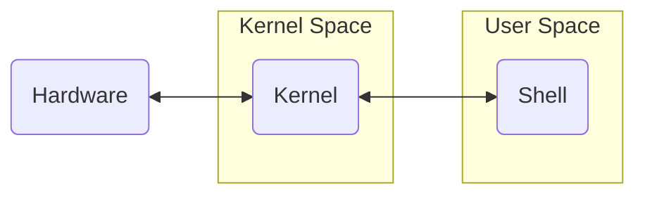

Type: [[Formação Linux - Udemy]]  #linux #udemy

---

- Users give commands to the Shell -> Shell contacts the Kernel -> Kernel contacts the Hardware
- The kernel is the core of the operating system, containing information about the CPU, system performance, and other critical data.
#### Kernel has 4 jobs:
1. **Memory Management:** How much memory is used to store what, and where;
2. **Process Management:** Determine which processes can use the CPU, when, and for how long;
3. **Device Drivers:** Act as mediator/interpreter between the hardware and processes;
4. **System calls and security:** Receive requests for service from the processes;
(https://www.redhat.com/en/topics/linux/what-is-the-linux-kernel)
### Distributions
- Are implementations of a Linux kernel and often a package management system;
- Each distribution have a collection of tools, libraries and software;

Links:
 - Kernel Org: https://www.kernel.org/

